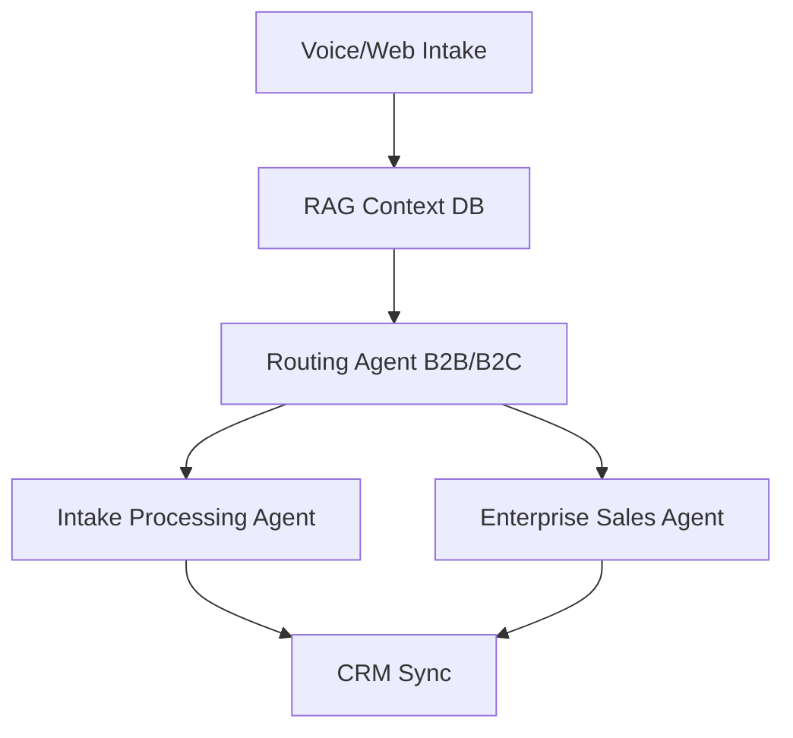

# EngageOS Customer Intake Engine

An autonomous 5-stage pipeline orchestrating multi-agent CrewAI workflows. Integrates localized RAG for AI voice intake and automated content generation.

## Architecture



## Features
- **Multi-Agent Coexistence:** CrewAI orchestration ensuring synchronized pipeline hand-offs.
- **Localized RAG Ingestion:** Converts unstructured voice transcripts into structured JSON schemas.
- **Data Segregation:** Strictly partitions B2B and B2C logic contexts.

## Setup
```bash
pip install -r requirements.txt
python src/main.py
```
